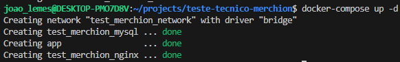
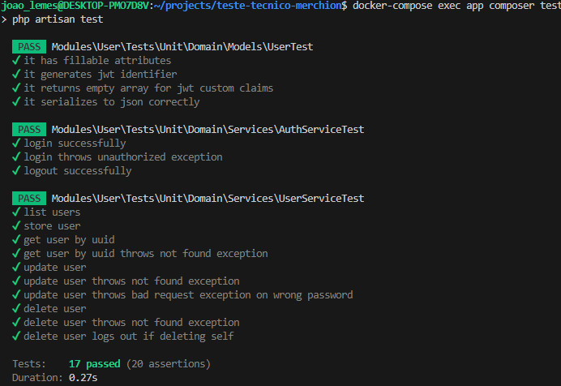
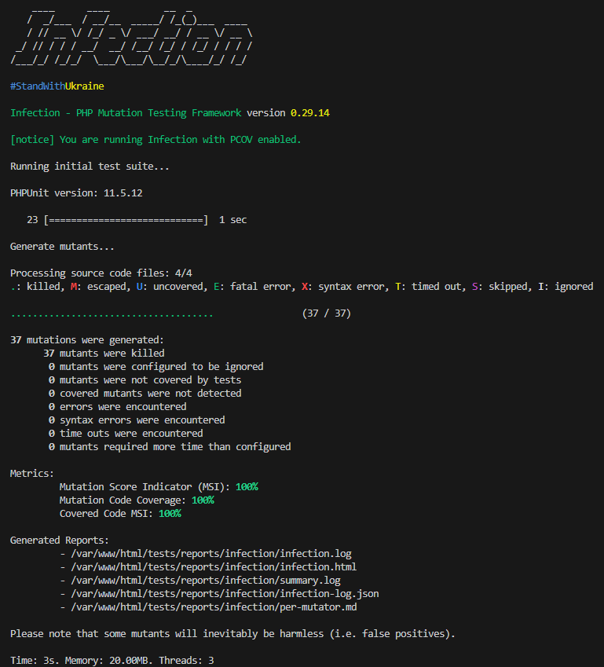

# Teste Técnico Merchion

Projeto desenvolvido para avaliação técnica, seguindo princípios de DDD (Domain-Driven Design), clean arch e utilizando testes de mutação para garantir a robustez do código.


## Dados técnicos

```
PHP: 8.3
Laravel: 11.3
Mysql: 8.0
Vue: 3
```


## Configuração

### Copiar arquivo .env

Faça uma cópia dos arquivos `.env.example` para `.env` que estão na raiz do projeto


### Subir docker

```
docker-compose up -d --build
```

Obs: Estas máquinas tem que estar rodando:<br>


### Instalar dependências

```
docker-compose exec app composer install
docker-compose exec app npm install
```

### Migrar banco de dados

```
docker-compose exec app php artisan migrate
```

### Adicionar permissão para a pasta storage

```
sudo chmod 777 -R storage/
```

## Comandos extras

### Executar testes

```
docker-compose exec app composer test
docker-compose exec app composer test:mutation
```

Testes:<br>


Teste mutation:<br>


## Links úteis

### Documentação Postman

Link para a aplicação: [http://localhost](http://localhost)
Documentação: [https://documenter.getpostman.com/view/14196384/2sAYkANMBj](https://documenter.getpostman.com/view/14196384/2sAYkANMBj)
